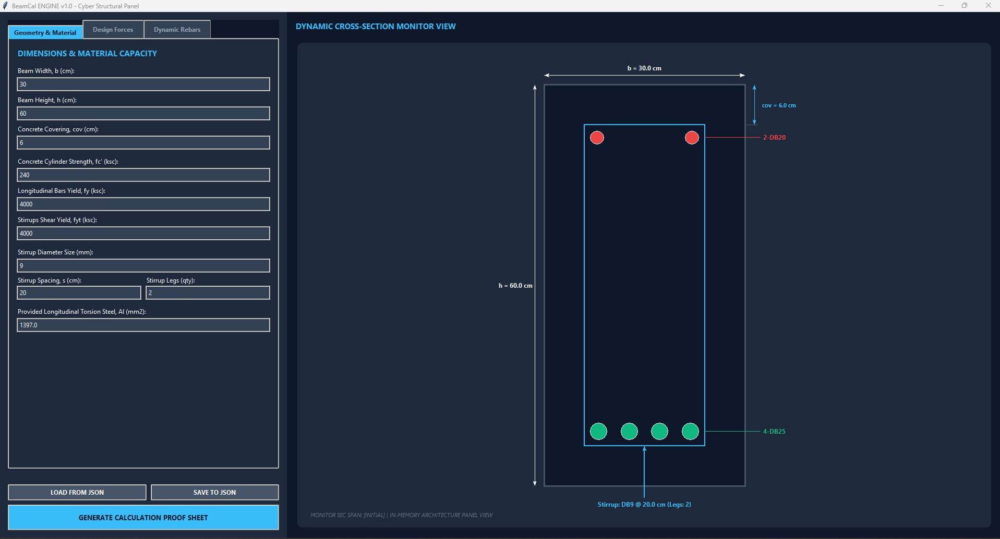

# BeamCal Engine v1.0

[](https://www.python.org)
[](LICENSE)

A Python desktop application for the structural verification of reinforced concrete beam sections under flexure, shear, and combined torsion according to ACI 318-14 specifications.



---

## Features

An all-in-one verification panel utilizing high-precision analytical solvers to ensure structural safety and full compliance with ACI 318-14 limits.

## Module 4 – Shear Engine

Evaluates concrete and stirrup capacity under factored shear loads ($V_u$), incorporating axial load ($P_u$) effects according to ACI 318-14.

### Core Formulation

* **Concrete shear strength ($V_c$):**
  * Axial compression ($P_u > 0$):
    $$V_c = 0.53 \left(1 + \frac{P_u}{140 A_g}\right) \sqrt{f'_c} b d \quad \le 0.53 \times 1.5 \sqrt{f'_c} b d$$
  * Axial tension ($P_u < 0$):
    $$V_c = \max\left(0, \, 0.53 \left(1 + \frac{P_u}{35 A_g}\right) \sqrt{f'_c} b d\right)$$
  * No axial load ($P_u = 0$):
    $$V_c = 0.53 \sqrt{f'_c} b d$$

* **Stirrup shear strength ($V_s$):**
  $$V_s = \frac{A_v f_{yt} d}{s}$$

* **Design shear strength verification (with $\phi = 0.85$):**
  $$\phi V_n = \phi(V_c + V_s) \ge V_u$$

* **Stirrup spacing limits ($s_{max}$), based on required strength contribution ($V_{s,req} = \frac{V_u}{\phi} - V_c$):**
  $$s_{max} = \begin{cases} 
  \min(d/4, \, 30 \text{ cm}) & V_{s,req} > 1.1 \sqrt{f'_c} b d \\ 
  \min(d/2, \, 60 \text{ cm}) & V_{s,req} \le 1.1 \sqrt{f'_c} b d 
  \end{cases}$$

* **Minimum shear reinforcement (required when $V_u > 0.5 \phi V_c$):**
  $$\left(\frac{A_v}{s}\right)_{\text{min}} = \max\left(\frac{0.2 \sqrt{f'_c} b}{f_{yt}}, \, \frac{3.5 b}{f_{yt}}\right)$$

* **Maximum stirrup contribution limit:**
  $$V_s \le 2.1 \sqrt{f'_c} b d$$
  *(Limits stirrup steel to prevent brittle concrete web crushing failure)*

## Module 5 – Torsion Engine

Evaluates the torsional capacity, checks for combined shear-torsion interaction, and determines the required transverse and longitudinal reinforcement according to ACI 318-14.

### Core Formulation

* **Geometric parameters (centerline of stirrup):**
  $$x_1 = b - 2\left(\text{covering} + \frac{d_{\text{stirrup}}}{2}\right)$$
  $$y_1 = h - 2\left(\text{covering} + \frac{d_{\text{stirrup}}}{2}\right)$$
  $$A_{oh} = x_1 \cdot y_1, \quad p_h = 2(x_1 + y_1), \quad A_o = 0.85 A_{oh}$$

* **Torsional threshold and cracking limits ($\phi = 0.75$):**
  $$T_{th} = \phi \cdot 0.27 \sqrt{f'_c} \left(\frac{A_{cp}^2}{P_{cp}}\right) \quad (\text{Torsion active if } T_u > T_{th})$$
  $$T_{cr} = \phi \cdot 1.1 \sqrt{f'_c} \left(\frac{A_{cp}^2}{P_{cp}}\right)$$
  *(where $A_{cp} = b \cdot h$ and $P_{cp} = 2(b + h)$)*

* **Combined shear-torsion web crushing limit ($\phi = 0.85$):**
  $$\sqrt{\left(\frac{V_u}{b d}\right)^2 + \left(\frac{T_u p_h}{1.7 A_{oh}^2}\right)^2} \le \phi \left(\frac{V_c}{b d} + 2.1\sqrt{f'_c}\right)$$

* **Torsional transverse reinforcement (per single stirrup leg):**
  $$\frac{A_t}{s} = \frac{T_u}{2 \phi A_o f_{yt}} \quad (\text{with } \phi = 0.75)$$

* **Combined shear and torsion minimum area limit:**
  $$\text{Governing stirrup ratio} = \max\left(\frac{A_{v,\text{shear}}}{s} + \frac{2 A_t}{s}, \, \left(\frac{A_v}{s}\right)_{\text{min}}\right)$$

* **Maximum torsion stirrup spacing limit:**
  $$s_{max} = \min\left(\frac{p_h}{8}, \, 30 \text{ cm}\right)$$

* **Longitudinal torsion reinforcement ($A_l$):**
  $$A_l = \max(A_{l,\text{req}}, \, \max(0.0, \, A_{l,\text{min}}))$$
  $$A_{l,\text{req}} = \left(\frac{A_t}{s}\right) p_h \left(\frac{f_{yt}}{f_y}\right)$$
  $$A_{l,\text{min}} = \frac{1.33 \sqrt{f'_c} A_{cp}}{f_y} - \left(\frac{A_t}{s}\right)_{\text{clamped}} p_h \left(\frac{f_{yt}}{f_y}\right)$$
  *(where the clamp is defined as $\left(\frac{A_t}{s}\right)_{\text{clamped}} = \max\left(\frac{A_t}{s}, \, \frac{1.78 b}{f_{yt}}\right)$)*

---

## Installation

**Requirements:** Python 3.8+

1. Install the required dependencies:

    ```bash
    pip install -r requirements.txt
    ```

2. Run the application:

    ```bash
    python "concrete beam reinforcement ACI 318-14.py"
    ```

---

## Workflow & Data Example

The application handles configurations via an `input.json` file located in the root directory. You can edit variables via the file directly or use the interactive Tkinter entry bars.

> **Note:** The sample below includes `//` comments for readability. Standard JSON does not support comments — remove them before using this as an actual input file, or configure your parser to accept JSONC.

### 1. Input Sample (`input.json`)

```jsonc
{
  "fc_prime": 240,       // Concrete compressive strength (Default: kg/cm²)
  "fy": 4000,            // Longitudinal reinforcement yield strength (Default: kg/cm²)
  "fy_shear": 4000,      // Stirrup yield strength (Default: kg/cm²)

  "b": 30,
  "b_unit": "cm",
  "h": 60,
  "h_unit": "cm",

  "covering": 6,
  "cov_unit": "cm",

  "stirrup_dia": 9,       // Stirrup diameter (Default: mm)
  "stirrup_spacing": 20,  // Stirrup spacing (Unit matches geometry, e.g., cm)
  "stirrup_legs": 2,      // Number of shear legs

  "forces": {
    "INITIAL": {
      "Mu": 45000, "Mu_unit": "kg-m",
      "Vu": 8000,  "Vu_unit": "kg",
      "Pu": 0,     "Pu_unit": "kg",
      "Tu": 0,     "Tu_unit": "kg-m"
    },
    "MID": {
      "Mu": 45000, "Mu_unit": "kg-m",
      "Vu": 8000,  "Vu_unit": "kg",
      "Pu": 0,     "Pu_unit": "kg",
      "Tu": 0,     "Tu_unit": "kg-m"
    },
    "END": {
      "Mu": 0,     "Mu_unit": "kg-m",
      "Vu": 0,     "Vu_unit": "kg",
      "Pu": 0,     "Pu_unit": "kg",
      "Tu": 0,     "Tu_unit": "kg-m"
    }
  },

  "rebars": {
    "INITIAL": {
      "top": [{"dia": 20, "qty": 2, "clear_dist": 0}],
      "bot": [{"dia": 25, "qty": 4, "clear_dist": 0}]
    },
    "MID": {
      "top": [{"dia": 20, "qty": 2, "clear_dist": 0}],
      "bot": [{"dia": 25, "qty": 4, "clear_dist": 0}]
    },
    "END": {
      "top": [{"dia": 20, "qty": 2, "clear_dist": 0}],
      "bot": [{"dia": 20, "qty": 2, "clear_dist": 0}]
    }
  }
}
```

### 2. UI Operation

1. Load or modify geometry parameters in the input tabs.
2. The UI canvas will dynamically re-draw the rebar layers, steel loops, and dimension lines.
3. Click **"GENERATE CALCULATION PROOF SHEET"** to export the verification logs.

---

## Engineering Boundaries & Limitations

- **Geometry**: Limited strictly to solid rectangular sections. T-beams, L-beams, or hollow sections are not supported.
- **Seismic Provisions**: Calculations assume ordinary flexural members. Special Moment Frame (SMF) capacity design and seismic hoop spacing limits are out of scope.
- **Limit States**: Verification is only applied to Ultimate Strength limit states. Serviceability checks (deflections, long-term crack width mapping) must be executed separately.

---

## Author

**ARIYA**
Structural engineer & developer of BEAM ANALYSIS ACI318-14.

---

## Credits & Acknowledgments

### Core Infrastructure
Developed entirely by the author (ARIYA):
- Bisection numerical solver mechanics.
- Metric MKS unit ingestion pipeline.
- Tkinter UI components and visual canvas rendering.

### Compliance Logic References
The underlying workflow sequence for shear/torsion interactions and axial-load conditional logic was built referencing the open-source architecture of [ConcreteDesignPy](https://github.com/albertp16/concretedesignpy) by Albert Pamonag Engineering Consultancy, used under the terms of the MIT License. See [`THIRD-PARTY-NOTICES.md`](THIRD-PARTY-NOTICES.md) for the original copyright notice.

---

## Disclaimer

This software is provided "as is" for educational and preliminary verification purposes only. Calculations must be reviewed and certified by a licensed professional structural engineer before deployment in real-world construction setups. The author assumes no liability for structural failures or financial damages arising from the use of this code.

---

## License

Distributed under the MIT License. See `LICENSE` for details.
